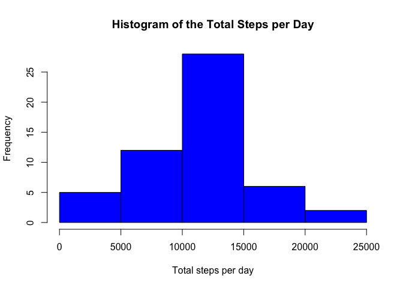
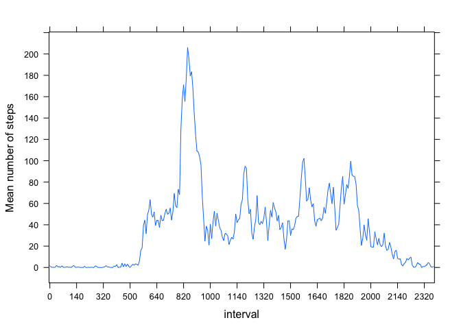
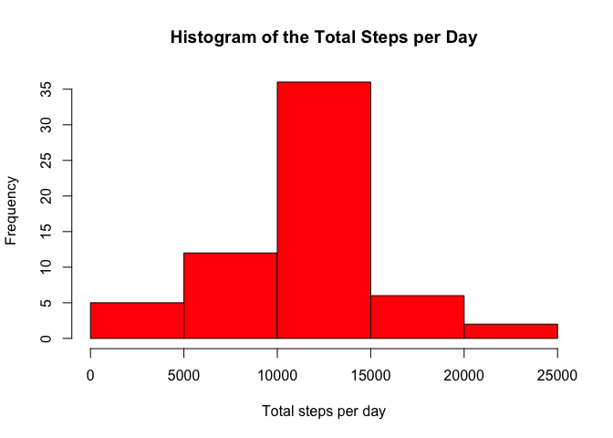
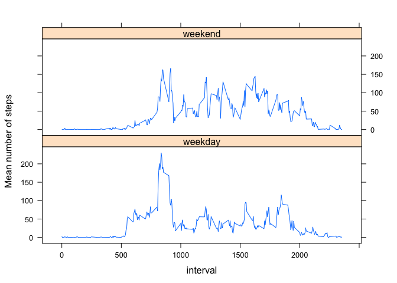

# Reproducible Research: Peer Assessment 1


## Loading and preprocessing the data
First, unzip, place the CSV file in the current directory, and load the data.

```r
if(!file.exists('activity.csv')){
        unzip('activity.zip', exdir='./')
}
data <- read.csv('activity.csv')
```


## What is the mean total number of steps taken per day?
Filter out rows containing NA values and then histogram the total number of steps per day. Find the mean and median number of steps.

```r
library(plyr)
library(dplyr)
data_noNA   <- filter(data, !is.na(steps))
stepsPerDay <- ddply(data_noNA, .(date), summarize, sum = sum(steps))
hist(stepsPerDay$sum, xlab='Total steps per day', main='Histogram of the Total Steps per Day', col='blue')
```

 

```r
print(paste("The mean is:", round(mean(stepsPerDay$sum), 3)))
```

```
## [1] "The mean is: 10766.189"
```

```r
print(paste("The median is:", median(stepsPerDay$sum)))
```

```
## [1] "The median is: 10765"
```


## What is the average daily activity pattern?

```r
library(lattice)
data_noNA <- mutate(data_noNA, interval=as.factor(interval))
intervalAvg <- ddply(data_noNA, .(interval), summarize, mean = mean(steps))
xyplot(mean ~ interval, data=intervalAvg, type='l', ylab='Mean number of steps', scales=list(x=list(tick.number = 20, at = seq(1, 300, 20)), y=list(tick.number = 15)))
```

 

```r
# Find the interval with the maximum number of steps
max <- intervalAvg$interval[which.max(intervalAvg$mean)]
print(paste("The interval containing the largest average number of steps is:", max))
```

```
## [1] "The interval containing the largest average number of steps is: 835"
```

## Imputing missing values
Missing values will be replaced with the average number of steps taken in its 5-minute interval. These values are obtained from the *intervalAvg* data frame defined above.

```r
# Find the total number of rows with NA values
isna <- sum(is.na(data))
print(paste("The total number of rows with NA values is:", isna))
```

```
## [1] "The total number of rows with NA values is: 2304"
```

```r
## Replace missing values with the average # of steps for its 5-minute interval
for (row in 1:nrow(data)){
        if(is.na(data$steps[row])){
                thisInterval    <- data$interval[row]
                data$steps[row] <- intervalAvg$mean[which(intervalAvg$interval == thisInterval)]
        }
}
```

Histogram the total number of steps per day using the new imputed data and compute the mean and median values.

```r
# Histogram of the total # of steps taken each day with the imputed data
newStepsPerDay <- ddply(data, .(date), summarize, sum = sum(steps))
hist(newStepsPerDay$sum, xlab='Total steps per day', main ='Histogram of the Total Steps per Day', col='red')
```

 

```r
# Find the mean and median of the total number of steps taken per day
print(paste("The mean is:", round(mean(newStepsPerDay$sum), 3)))
```

```
## [1] "The mean is: 10766.189"
```

```r
print(paste("The median is:", round(median(newStepsPerDay$sum), 3)))
```

```
## [1] "The median is: 10766.189"
```


## Are there differences in activity patterns between weekdays and weekends?

```r
# Convert dates to Date type
data$date <- as.Date(data$date)
weekends <- c("Saturday", "Sunday")
```
Add a new variable to the data frame called *dayType* that records whether the date is a weekday or on a weekend.

```r
# Create new column in data frame which stores "weekend" or "weekday"
data$dayType <- ifelse(weekdays(data$date) %in% weekends, c("weekend"), c("weekday"))
```

Compare the activity on weekdays and weekends by interval in the day. Notice less activity in the early hours on weekends (e.g. people may sleep in) as well as lower activity during work hours mid-day on weekdays (e.g. people sitting at their desks).

```r
# Panel plot showing 5-minute interval averages for weekdays and weekends
data$dayType <- as.factor(data$dayType)
intervalAvgNew <- ddply(data, .(interval, dayType), summarize, mean = mean(steps))
xyplot(mean ~ interval | dayType, data=intervalAvgNew, type='l', ylab='Mean number of steps', layout=c(1,2))
```

 


